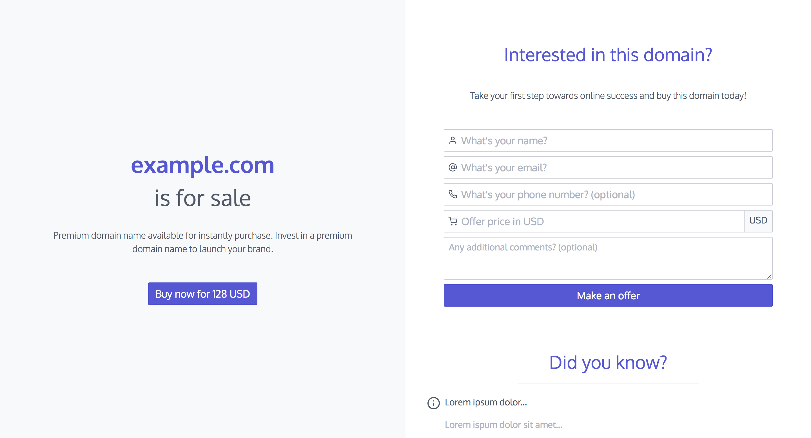

# Mercury - Responsive domain reseller landing page



Mercury is a free responsive domain reseller landing page. The project has also included a PHP file which allows to send offers directly from the site. The final HTML is generated by Sculpin. It is divided into few sections:

* Contact form
* Fun facts about domains
* Contact details
* Copyrights
* Cookie message

## Installation
```bash
$ git clone https://github.com/terenaa/mercury-reseller-landing-page.git domain_landing_page
$ cd domain_landing_page
$ composer install
```

## Generating landing page
After installing all composer dependencies it requires a few more steps of configuration.

### Configuration

Open `app/config/sculpin_site.yml`. This is the file where almost all settings will be placed. Only email and ReCaptcha settings are put in `app/config/sculpin_kernel.yml`.

Every section can be hidden by setting `visible: false` (except **Buy now** - no `visible` option; **cookie message** - depends on ReCaptcha settings).

#### General page settings

Language of the landing page.

```yaml
# app/config/sculpin_site.yml

lang: en
```

#### Domain details

Primary domain details.

```yaml
# app/config/sculpin_site.yml

domain:
  name: example.com
  title: is for sale
  description: ~
  price: 99
  currency: USD
```

#### Buy now option

**Buy now** button will not show if its label will be empty.

```yaml
# app/config/sculpin_site.yml

buy_now:
  button: Buy now for %domain.price% %domain.currency%
```

#### Contact form settings

This settings section contains also **ReCaptcha public key**.

```yaml
# app/config/sculpin_site.yml

form:
  visible: true
  header: Interested in this domain?
  description: Lorem ipsum dolor sit amet.
  fields:
    name:
      text: What's your name?
      required: true
    email:
      text: What's your email?
      required: true
    phone:
      text: What's your phone number?
      required: false
    offer:
      text: Offer price in %domain.currency%
      required: true
    comments:
      text: Any additional comments?
      required: false
  buttons:
    make_offer:
      text: Make an offer
  optional: (optional)
  success_message: Your message has been sent successfully.
  error_message: Ooops! Something went wrong.
  go_back_button: Go back
  recaptcha:

    # Public key of ReCaptcha only if form section is visible and ReCaptcha is enabled
    public_key: ~
```

#### Pros of the domain

Maximum number of pros is 3.

```yaml
# app/config/sculpin_site.yml

why_this_domain:
  visible: false
  header: Why %domain.name%?
  description: Lorem ipsum dolor sit amet.
  pros:
    -
      header: long & hard
      description: Lorem ipsum dolor sit amet.
    -
      header: 5+ backlinks
      description: Lorem ipsum dolor sit amet.
    -
      header: 98 years old
      description: Lorem ipsum dolor sit amet.
```

#### Facts about domains or whatever

```yaml
# app/config/sculpin_site.yml

did_you_know:
  visible: true
  header: Did you know?
  facts:
    -
      header: Some fact 1
      description: Some fact 1 description
    -
      header: Some fact 2
      description: Some fact 2 description
  provided_by: '* All fun facts provided by Some Company'
```

#### Contact details

All icons are provided by [Feather Icons](https://feathericons.com/). Available, proposed icons: *phone*, *at-sign*, *mail*, *facebook*, *instagram*, *link*, *linkedin*, *twitter*. Maximum number of channels is 2. 

```yaml
# app/config/sculpin_site.yml

contact:
  visible: false
  channels:
    -
      type: phone
      account: +1 000 000 000
    -
      type: mail
      account: domains@example.com
```

#### Footer / copyrights

Footer displays copyright info, e.g. `© YEAR domain.com`. The template can be edited in `source/_partials/footer.html.twig`.

```yaml
# app/config/sculpin_site.yml

footer:
  visible: false
```

#### Robots

This option allows you to decide if you want to permit robots and spiders to index your domain for sale. Default value is *false*.

```yaml
# app/config/sculpin_site.yml

robots:
  allow_indexing: false
```

#### Cookie message

Cookie message is displayed only if ReCaptcha is enabled. When your country does not require such information leave this setting empty (`~`). 

```yaml
# app/config/sculpin_site.yml

cookie_message: Lorem ipsum dolor sit amet.
```

#### Emails & ReCaptcha

Email settings and ReCaptcha secret, because of their nature, are placed in `app/config/sculpin_kernel.yml`. Remember that ReCaptcha public key is set in `form` section.

```yaml
dlp_mail:
  subject: 'New offer for domain %s'
  recipient:
    name: The Boss
    email: the.boss@example.com
  recaptcha:
  
    # Secret key of ReCaptcha only if form section is visible and ReCaptcha is enabled
    secret: ~
```

### Generating
```bash
$ vendor/bin/sculpin generate --env=prod
```

After generating successfully deploy content of `output_prod` directory.

## Features
* Fully responsive
* HTML5 + CSS3
* Built on Spectre 0.5.1
* Compatible with all modern browsers

## Contributing

Did you found a bug or got an idea? Feel free to use the [issue tracker](//github.com/terenaa/mercury-reseller-landing-page/issues). Or make directly a [pull request](//github.com/terenaa/mercury-reseller-landing-page/pulls).

## Credits
* [Sculpin](https://sculpin.io/)
* [Spectre](https://picturepan2.github.io/spectre/)
* [Feather icons](https://feathericons.com/)
